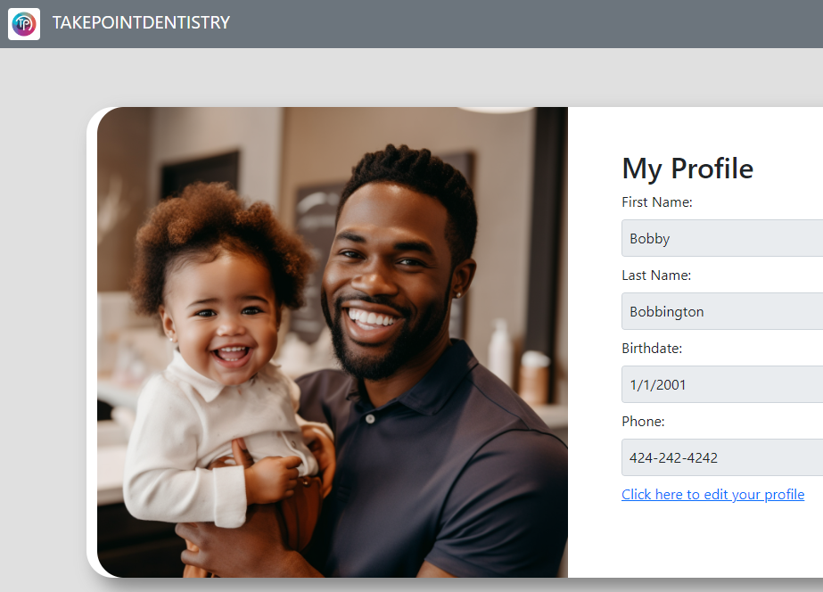

# Scheduler

## Description
A site that allows a user to log in or create a profile if they don’t already have one. They can then view their current appointments, cancel existing appointments or schedule new ones.
We use Nodemailer API to send confirmation emails to the user after they have made an appointment.
The process of creating an appointment includes all the relevant data to the user, including who they would like to schedule with, what time and date, where the appointment will be, and what service they require.

## Installation
N/A

## Usage 

## Credits
https://github.com/connbstro  -  https://github.com/BiaJorgensen  -  https://github.com/Ross-Boughman

https://www.freecodecamp.org/news/use-nodemailer-to-send-emails-from-your-node-js-server/

